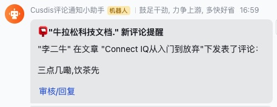

# Comment webhook bridge for Cusdis to Feishu

## 干了啥
Cusdis will send webhook notifications when new comments arrive. Just post this url as your webhook and I will notify your guys in Feishu

当有新的评论时，Cusdis可以向webhook发送请求，本serverless function可以接收这个请求并转化为飞书所需的格式发送到群里

## 步骤

1. 创建一个飞书群，在群里加入一个机器人 [使用指南](https://open.feishu.cn/document/ukTMukTMukTM/ucTM5YjL3ETO24yNxkjN?lang=zh-CN#-537b966) 并获取webhook地址和secret签名
2. fork本项目clone代码，准备部署到你喜欢的serverless平台
3. 开发环境根目录从模板文件创建`.env`文件，填写3个key `FEISHU_SECRET`、`FEISHU_WEBHOOK_URL`、`WEBHOOK_TOKEN`(自己定义的口令)，部署以后需要配置3个key为环境变量。OFC，如果你本地使用vercel --prod来部署，那就不必了。
4. 我们的api在`pages/api/[webhook_token].ts`下, token会包含在链接中，值同`WEBHOOK_TOKEN`，建议用uuid随机一个长字符串。如果配置WEBHOOK_TOKEN为`sdsdf0b2c6f764`，那么在cusdis的webhook应该填写 `domain + /api/sdsdf0b2c6f764`, 例如https://cusdis-feishu-webhook.newrathon.com/api/sdsdf0b2c6f764。其他文件无需care
5. Cusdis 后台填写webhook正式地址


## 测试方法

本地执行`next dev`启动然后curl下

```bash
#api后的字符串必须和env中的一致
curl -X "POST" "http://localhost:3000/api/c6f7764e5284feb3050c8fa6bp84b090a" \
     -H 'Content-Type: text/plain; charset=utf-8' \
     -d $'{"type":"new_comment","data":{"by_nickname":"李二牛","by_email":"","content":"三点几嘞,饮茶先","page_id":"xxx","page_title":"Connect IQ从入门到放弃","project_title":"Newrathon Tech.","approve_link":""}}
```
效果如下




## Deploy on Vercel

[](https://vercel.com/new/clone?repository-url=https%3A%2F%2Fgithub.com%2FLikenttt%2Fcusdis-comment-feishu-webhook&env=WEBHOOK_TOKEN,FEISHU_WEBHOOK_URL,FEISHU_SECRET)
